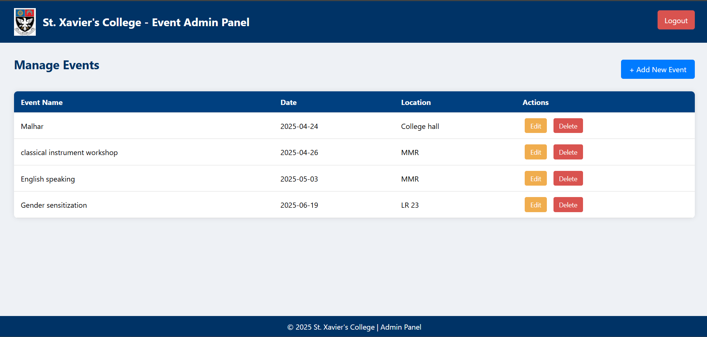
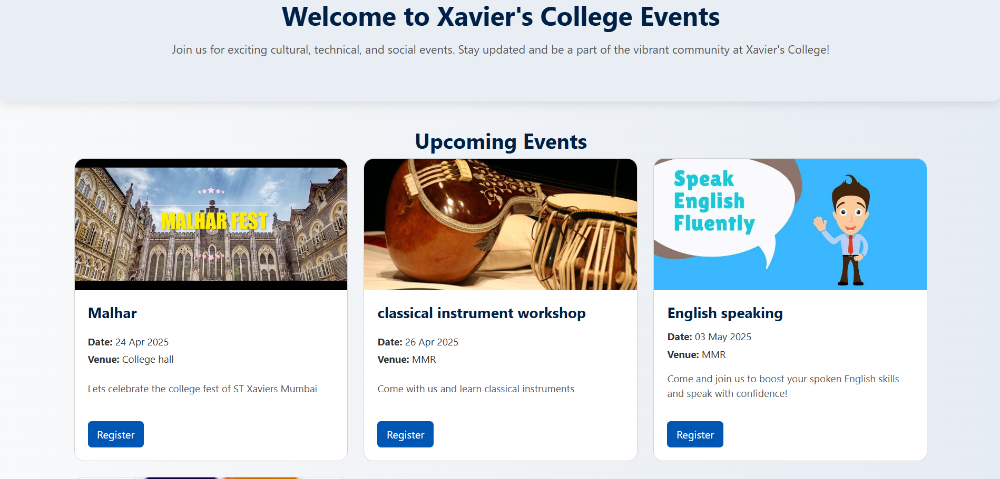

# 🎫 Event Portal Project

A simple and user-friendly Event Portal built using **PHP** and **MySQL**. This platform allows users to browse events, register for them, and download a ticket after successful registration. It also includes a secure admin panel to manage events and view participant details.

---

## 💡 Features

### 👥 Users:
- View a list of upcoming events
- Register for events using a simple form
- Instantly download a ticket after registering

### 🛠 Admins:
- Password-protected admin panel for secure access
- Add, edit, and delete events
- View and manage all registrations
- Monitor event participation easily

---

## 🧰 Tech Stack

- **Frontend**: HTML, CSS  
- **Backend**: PHP  
- **Database**: MySQL  

---

---

## 🖼️ Screenshots

### 🔸 Admin Dashboard

### 🔸 User Dashboard

### 🔸 Ticket Pdf sample

---

## 📩 Contact

**Aniket H. Singh**  
📧 [aniket.singh.st1@gmail.com](mailto:aniket.singh.st1@gmail.com)
